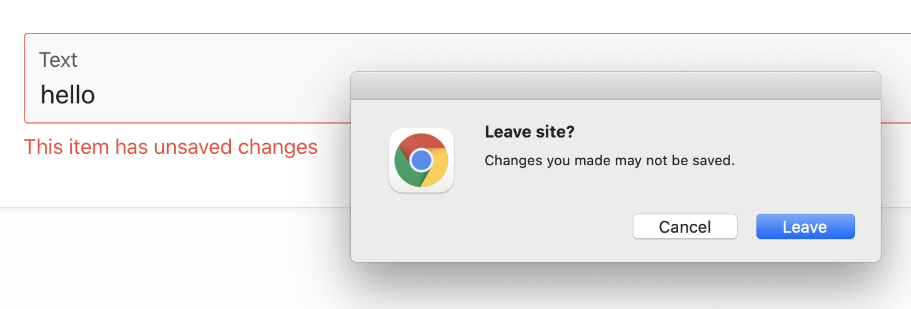

# Plugin to Enhance the "Warn on Unsaved Changes" UX

## Description

This Oracle APEX plugin is designed to provide item-level feedback on which page item holds the "unsaved changes" that trigger the alert "Leave Site?Changes you made may not be saved." Specifically, the message "This item has unsaved changes" will be added next to the offending item in question, for e.g. :

## How To

1.  Install the plugin in your APEX application
2.  On Page 0, add a page load dynamic action with a true action of type "Warn on Unsaved Change Enhancement [Plug-In]
3.  Done! Visit a page for which "Warn on Unsaved Changes" is turned on at both the page and item level and attempt to leave said-page with an unsaved change to observe the behavior (screenshot above as illustration).

## Notes

### Compatibility

This plugin can be installed APEX environments 20.2 and higher. If you wish to make use the functionality in a lower APEX environment, you can follow the steps described in this video : [How to find out which Items changed in APEX](https://youtu.be/4VntEDmShXg)

### Modal Pages

This plugin is designed to not operate on Modal Pages.

### Further viewing / reading

This plugin was inspired by Episode #20 from the APEX Instant Tip series:
[How to find out which Items changed in APEX](https://youtu.be/4VntEDmShXg)

